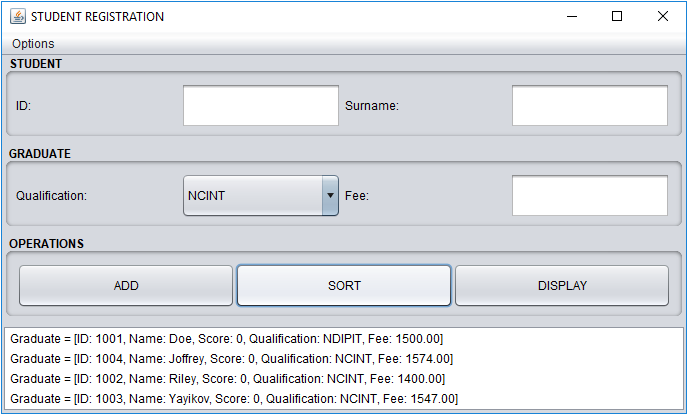

# Student Registration
This is a java program that facilitates registrations of students.
It keeps records of the id, name, relevant certificates to be handed 
in and the fees to be paid for the academic year.

## What Does the App Do
* This app allow the user to record students details

 

 

* It can sort the students by their names

 

 

 

* It displays the stored students in a JList

## Status of Project
I am still thinking to add some more functionalities such as deleting students, changing details and
checking user input before adding to the list.

## Author
Claude C DE-TCHAMBILA

